

<!-- Attention authors: Do not edit directly. Please add your changes to the appropriate source repository -->

# Designing dashboard interfaces with HABPanel

The [HABPanel]({{base}}/addons/ui/habpanel/readme.html) user interface is installed by default when choosing any initial setup package, and allows the creation of user-friendly dashboards, particularly suited for (e.g. wall-mounted) tablets. These dashboards can be designed interactively in the embedded designer, rather than using configuration files.

Despite being similar, HABPanel's dashboards and [sitemaps]({{base}}/configuration/sitemaps.html) are separate concepts, and can be designed independently as they aren't related to each other; however, they rely and act on [items]({{base}}/concepts/items.html) which must therefore be [defined]({{base}}/configuration/items.html) first. The [demo setup package]({{base}}/configuration/packages.html#demo-package-sample-setup), available for installation when starting openHAB for the first time, defines a series of sample items and configures HABPanel with a comprehensive set of dashboards to showcase a possible end result. It's the same as the one installed on the [openHAB Demo Server](https://demo.openhab.org/){:target="_blank"}, and it may be modified without risk of breaking anything: it's the best playground to discover HABPanel's features.

## Concepts

HABPanel has its own terminology of entities presented below:


- The **Panel Registry** is the central storage used by HABPanel on a given openHAB instance, it contains several **Panel Configurations**;
- A **Panel Configuration** is a container holding a **Panel** along with its **Settings** and the definition of **Custom Widgets**. Each device HABPanel runs on (desktop browser, tablet...) has an active panel configuration and displays the panel associated with it;
- A **Panel** is a set of **Dashboards** (or pages) which can be presented to end users, who can also easily switch between them using the menu.
- A **Dashboard** is comprised of discrete **Widgets** positioned on the dashboard's surface at design time. There are several types of built-in *standard widgets*, configured separately, and the administrator can also develop (or import) *custom widgets*.

## About data persistence

By default, when running HABPanel on a new browser or device, a tutorial will be displayed allowing the user to start from scratch, or switch to an previously defined panel configuration. **Until a panel configuration is created (or chosen), HABPanel will run in "local storage" mode for this device: the settings will be retained in the browser's local storage only and nothing will be persisted on the server.** By contrast, when an active panel configuration is set, each change performed on the device will update the panel configuration on the server. This allows the sharing of panel configuration among devices, because other browsers and devices using this panel configuration will pick up the changes with a page refresh - this is useful for instance to design a panel comfortably on a computer, then use it on a tablet.

To switch from the local storage to a server-hosted panel configuration, go to the Settings page from the main menu or the side drawer (see below). A list of panel configurations will be presented in the _Current storage configuration_ section; if only the _"Local storage"_ option is available, click on the **Save the current configuration to a new panel configuration** link, give it a name to identify it (avoid spaces or special characters), and it should be added to the list. The radio button is also automatically checked, meaning it is now the active panel configuration.

Even when there is an active panel configuration, HABPanel uses the browser's storage to sync a locally-managed copy. With the **Edit the local panel configuration (experts only)** link under the _"Local storage"_ storage configuration option in the settings screen, the raw structure of the panel configuration can be inspected, modified, and exported or imported from/to a .json file. It is also an alternative way to backup, restore and share the configuration.

HABPanel uses service configuration variables to store its data on the openHAB server. They can be accessed using Paper UI (_Configuration > Services > UI > HABPanel > Configure_) or in the openHAB Karaf console:

```
openhab> config:edit org.openhab.habpanel
openhab> config:property-get <property>
```
The following properties are defined:

- `panelsRegistry`: contains the entire registry serialized in JSON, it is maintained by the application and shouldn't be modified directly (editing it by hand, while possible, is strongly discouraged);
- `lockEditing`: when enabled, all HABPanel instances will hide their editing features (a page refresh is necessary). When panels are complete and stable, it is advisable to turn on this setting so they cannot be easily modified by end users;
- `initialPanelConfig`: if this option is unset and no prior local configuration is detected, the tutorial will be displayed until some dashboards are added or a panel configuration is selected. This setting allows to bypass the tutorial and switch directly to the existing panel configuration with the given name.

## Major interface elements and features

### The main menu

The main menu is HABPanel's home page. It contains tiles linking to the panel's dashboards, and an icon to switch between the run mode and the edit mode (if available).


Use the gears icon in the top-right corner to switch between the two modes.

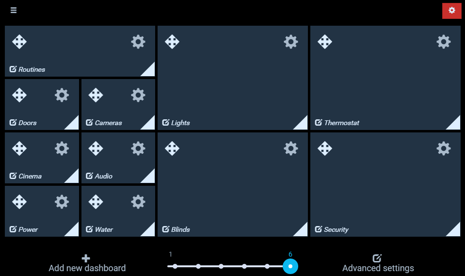

When in edit mode, several features are available:
* Add a new empty dashboard with the **Add new dashboard** link;
* Go to the settings screen (for instance, to switch from local storage to a server-managed panel configuration) by clicking on the **Advanced settings** link;
* Adjust the number of columns for the grid of main menu tiles with the slider, from 1 (the default) to 6;
* Drag the arrow icons in the top-left corner of each tile to move it;
* Resize tiles with the chevron (triangle) in the bottom-right corner of each tile;
* Configure the tiles and the dashboards themselves with the gears icons in the top-right corner of each tile;
* Enter the dashboard designer by clicking inside a tile.

The configuration dialog when clicking on a tile's gear icon contains the following settings:

| Setting | Description
|---------|-------------|
| Name | The name of the dashboard, also displayed on the tile
| Background URL | The URL of a background image *for the main menu tile*
| Backdrop Icon | Iconset and icon displayed on the tile as a Backdrop
| Center backdrop horizontally | When unchecked, the backdrop is aligned to the right of the tile; when checked, it is centered
| Icon | Icon associated with the dashboard, currently only used in the side drawer
| Size (icon) | _(currently unused)_
| Title Text Color | Color for the name of the dashboard on the tile
| Advanced tab | Contains settings currently unstable or unsupported, for advanced users only
| Custom widgets tab | This [experimental feature](https://community.openhab.org/t/new-display-options-incl-experimental-custom-widgets-everywhere/34140/1) allows certain parts of a dashboard to be replaced by a custom widget (see _Custom Widgets_ below): the main menu tile, the drawer menu and the dashboard item - use with caution

It also contains a **Delete** button which will delete the entire dashboard and its contents - this happens immediately and cannot be undone!

### The side drawer

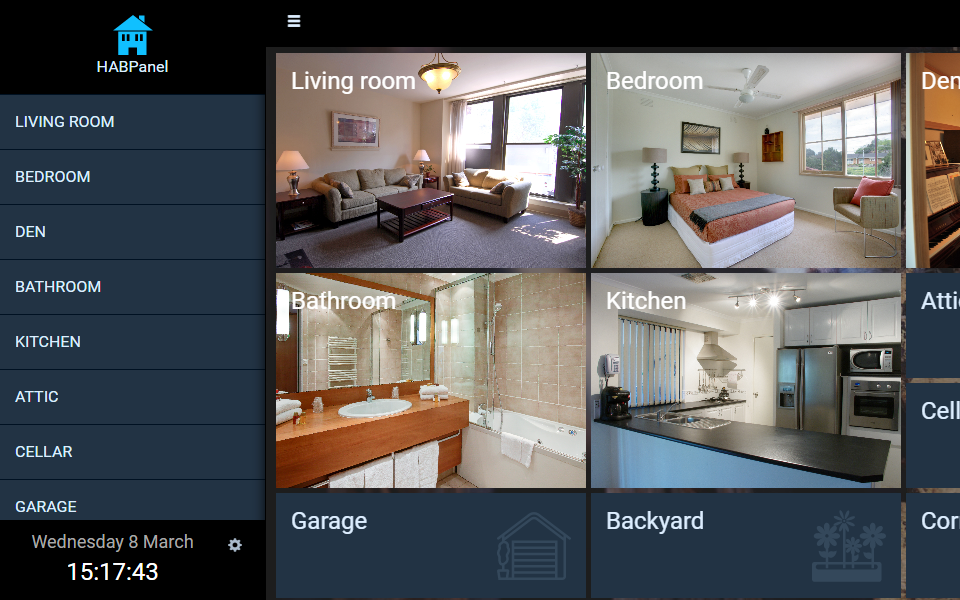

The side drawer can be accessed from any screen by a swipe or drag to the right (on most elements where there isn't a conflict with this gesture), or with the "hamburger icon" ☰ in the top-left corner.

It is comprised of three parts:

1. A **header** - clicking on it returns to the main menu. Note: if defined, the title of the panel is displayed instead of the default "HABPanel" label, it is configured in the settings (see below);
2. A **list of dashboards** for quick switching between dashboards without going back to the main menu - they are presented in the order of the menu (sorted by row, then by column);
3. A **footer** displaying the current date & time and featuring a link to the settings screen (if available).

### The dashboard designer

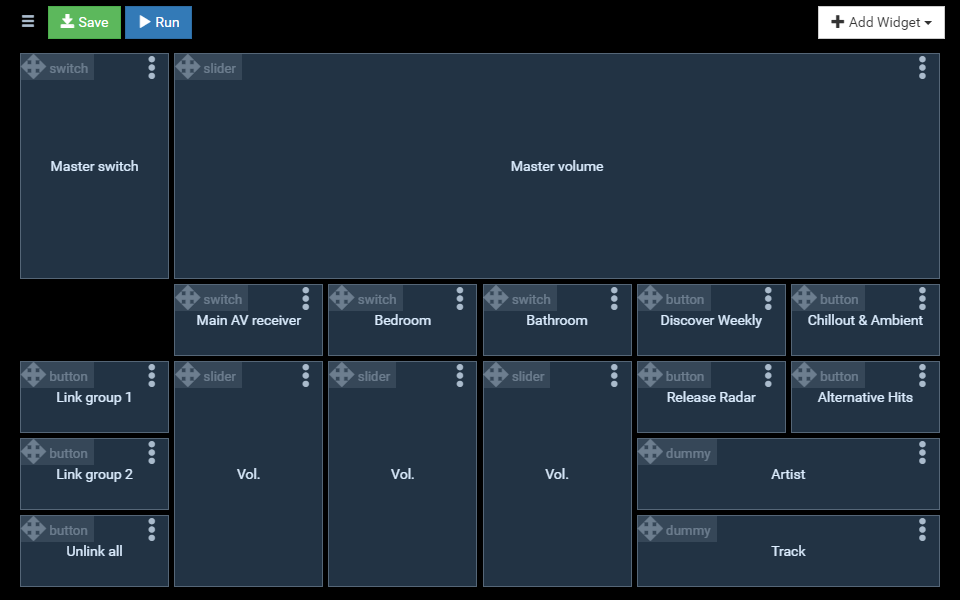

The dashboard designer is where widgets can be added, positioned, resized and configured. Placeholders are displayed where actual widgets would be on the running dashboard.

To add a widget, use the **Add widget** button and choose among the list of standard widgets, or eventual custom widgets in the panel configuration.
See below for a description of the standard widgets.

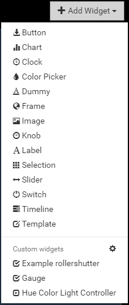

Use the header of a widget placeholder (with the four-arrow icon and the widget type) to move the widget. Moving a widget over other widgets do not push them away to make room (contrary to the main menu tiles), so ensure there is sufficient room for your widget before moving it.


When hovering over a placeholder (or tapping inside it if on a touch interface), a chevron appears in the bottom-right corner allowing to resize it.

Use the ellipsis icon **⁝** to bring up the widget's contextual menu, offering the following options:

- **Edit...:** Displays the configuration dialog for the widget. The options available in the dialog depend on the type of the widget and are detailed in the Widgets section;
- **Copy/move to...**: Displays a dialog allowing to clone the widget with its configuration, to the current dashboard or another, or move it to another dashboard (the target widget will retain its size of the source widget but it will be placed where there is available room, use the target dashboard's designer to find it and reposition it);
- **Delete**: Deletes the widget.

Modifications to the dashboard are not saved automatically, use the **Save** button in the header to commit the changes to the panel configuration (or local storage). The **Run** button also saves, then runs the dashboard.

### Running dashboards


When a dashboard is running, widgets can be interacted with, and server-sent events are received when items' states are updated, so widgets update automatically in HABPanel.

The icons in the top-right corner perform the following:
- the **speech balloon** activates the speech recognition feature and send the results as text to openHAB's default human language interpreter. This implies [some configuration on the server]({{base}}/configuration/multimedia.html#human-language-interpreter), and this icon might not be displayed if the browser doesn't support voice recognition ([mainly only in Chrome and other webkit variants currently](https://caniuse.com/#feat=speech-recognition){:target="_blank"}). It can also be configured in the panel configuration to appear on the bottom of the screen;
- the **refresh** button forces HABPanel to retrieve the current state of all items;
- the **fullscreen** button tells the browser to go fullscreen, if supported.

Tip: while running a dasboard, append `?kiosk=on` to the URL in the web browser to switch to "kiosk mode"; in this mode, the header, hamburger menu and toolbar will be hidden and the side drawer will be disabled - therefore there will be no easy way for an end user to switch to another screen (except with button widgets configured for that purpose). This mode is useful to display a full-screen, bare-bones UI for a fixed tablet.

## Additional features and settings

Apart from the storage configuration discussed above, the settings screen contains several settings kept as part of the panel configuration (meaning they are set separately):


| Setting | Description
|---------|-------------|
| Panel name | An user-friendly name for the panel. It will be displayed in the header of the side drawer.
| Theme | HABPanel comes with a number of built-in themes, with this setting a different theme may applied to the panel. Themes are not user-modifiable.
| Background image | Sets the specified URL as background image for the whole panel. *Tip: the background image works best with the 'translucent' theme!*
| Additional stylesheet | Reference the relative URL of an additional CSS file which will be included and can be used to override the styles defined by the theme. For additional information on how you can customize HABPanel's styles, go to: [HABPanel Development & Advanced Features: Start Here!](https://community.openhab.org/t/habpanel-development-advanced-features-start-here/30755/1)
| Drawer heading image | Reference the URL of an image (expected width: 265 pixels) which will replace the header in the side drawer
| Hide the drawer's footer | Check to remove the bottom black part of the side drawer containing the date & time
| Hide toolbar buttons (speak/refresh/fullscreen) | Check those boxes to hide the corresponding button in the default dashboard header top-right corner
| Show a clock in the header | If checked, a clock will be displayed in the main menu and the dashboards
| Header clock format (shown if "Show a clock in the header" is checked) | Use an [AngularJS' date filter format string](https://docs.angularjs.org/api/ng/filter/date) to customize the clock format in the header. The default is `HH:mm`
| Prevent scrolling (when not editing) | When enabled, it is impossible to scroll the dashboard on a tablet (and it prevents the "elastic" bouncing effect on iOS/Safari)
| Manage > (custom widgets) | Goes to the list of custom widget definitions for the active panel configuration
| Voice | Selects a voice from the detected list for text-to-speech*
| Speak the new value of the following item when it changes | When the selected String item change to a new text, HABPanel will use the browser's text-to-speech engine and the selected voice to read it aloud*
| Display a floating speech button at the bottom of the screen | Use an alternative style for the Speak (voice input) button in dashboards
| When this item changes to a dashboard's name, switch to it | This allows controlling the currently displayed dashboard by an openHAB item (useful with rules and as a side-effect to commands)

*Note: the text-to-speech functionality featured in HABPanel is unrelated to the [TTS services]({{base}}/configuration/multimedia.html#text-to-speech) defined on the openHAB server, and they are not compatible (this is why a String item is required and the `say()` function cannot be used). However, HABPanel will play audio streamed through the ['webaudio' sink]({{base}}/configuration/multimedia.html#audio), including spoken text.


## Widgets

### Standard widgets

The following built-in widgets are available:

#### Dummy (dummy)

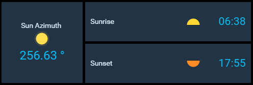

The so-called dummy widget (whose name is explained by historical reasons - it evolved from the first developed widget) displays the current state of an item without any interactivity, along with a label and an optional icon.

#### Switch (switch)

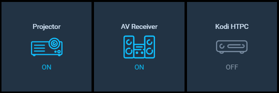

The switch widget is a simple widget to control a Switch item as defined in openHAB - it reports its state and is able to toggle it between ON and OFF.

#### Label (label)


The label widget is straightforward: it simply displays a fixed text and has a few appeareance options (color, font). It can for example be used as a header for a group of widgets below it.

#### Button (button)


The button widget can be clicked (or tapped) and will perform an action, like sending commands to an item or navigating to another dashboard. It can also adjust its colors depending on the state of the underlying item.

Multiple buttons are often used together to present different options for an item.

#### Slider (slider)


The slider widget can reflect the state of, and update, numerical items within a range of values. Several options are available to alter its appearance and behavior. 

#### Knob (knob)

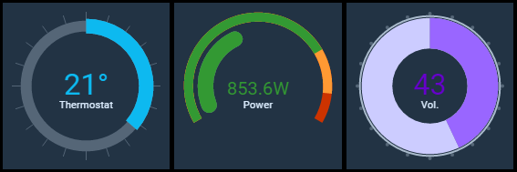

The knob widget is similar in essence to the slider, but in a rotary fashion. It also offers extensive configurability over its appearance and behavior.

#### Selection (selection)

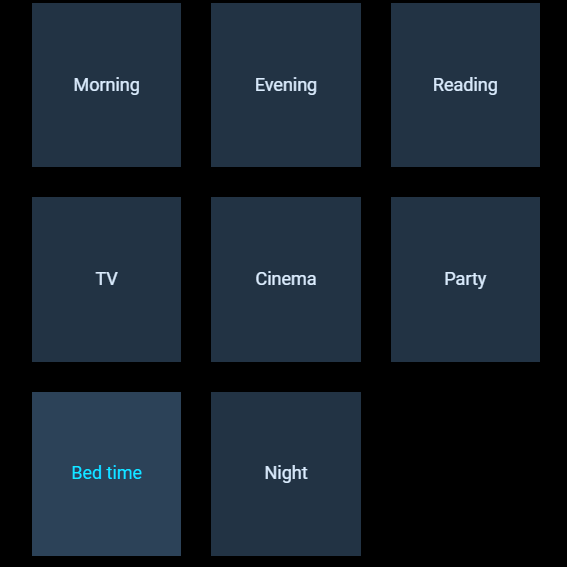

The selection widget displays the current state of an item, much like a dummy widget, except it opens a menu or a grid of automatically or manually configured choices for sending commands to this item. Various display options are available.

#### Color picker (colorpicker)

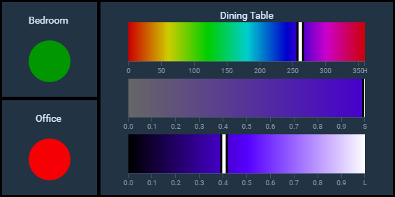

The color picker widget offers several ways of displaying and updating the state of an openHAB Color item (or group).

#### Image (image)


The image widget can display an image, directly or via an openHAB String item, and can refresh it at regular intervals.

#### Frame (frame)

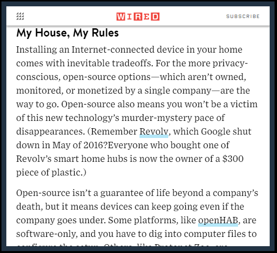

The frame widget displays an external web page in a HTML `<iframe>`.

#### Clock (clock)


The clock widget displays an analog or digital clock. It can also be used to display the current date.

#### Chart (chart)

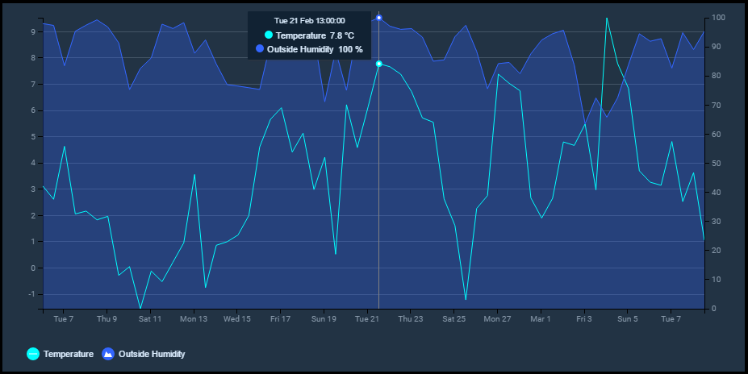

The chart widget can leverage openHAB persistence services to plot numerical series over a time period. It can also display server-generated chart images (default or rrd4j variants).

#### Timeline (timeline)

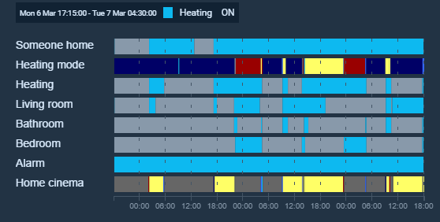

The timeline widget is the chart widget's counterpart for non-numerical items. It can display multiple "swimlanes" of items with color-coded slices representing their state changes during the selected period. Hovering or tapping inside a color slice displays details on the state of the item at the time.

#### Template (template)

The template widget allows an user-configured AngularJS HTML template to be rendered and hosted inside the widget boundaries; it exposes several helper functions and other facilities to retrieve and update openHAB's items from the template's markup.

With only a few web development skills required, you can easily start developing your own widgets and share them to community. It is nonetheless rather complex, so the best information has been compiled in this community wiki topic: [HABPanel Development & Advanced Features: Start Here!](https://community.openhab.org/t/habpanel-development-advanced-features-start-here/30755). You can also [learn by example in the forum's HABPanel category](https://community.openhab.org/c/apps-services/habpanel) or seek the help of the community.

Templates are defined inline, for each particular instance, and thus are not optimized for sharing and re-use. For those cases, developing a _custom widget_ is more appropriate.

### Custom widgets

Custom widgets are similar to (and based on) the template widget but are designed to be reused, shared, and configured. A custom widget is an AngularJS template with an associated set of configuration settings. It can be added to dashboards and configured individually, like a built-in widget. Definitions of custom widgets are stored in the registry at the panel configuration level; this means they are specific to a panel configuration and each panel configuration has its own custom widgets (see the _Concepts_ section above).

For more information, please read the [community thread about this feature](https://community.openhab.org/t/custom-widgets-feature-walkthrough/16670/1).

#### Managing custom widgets

The list of custom widgets either via the dashboard designer (click/tap the gears icon in the _Add Widget_ dropdown menu), or with the _Manage_ button in the settings screen.

From the list, custom widgets can be created from scratch, or imported from a previously exported .json file or a GitHub repository. Members of the openHAB community also present their custom widgets on the forum: the _Get widgets from the openHAB community_ link brings up a filtered lists of custom widgets from the community.

Widgets can also come from [an openHAB addon or OSGi bundle](https://community.openhab.org/t/new-feature-globally-provisioned-widgets-i-e-with-osgi-bundles/26994): those are "globally-provisioned widgets". They cannot be modified or deleted (but can be cloned and then modified), and are available to all panel configurations. 

The context menu **⁝** can be used to perform operations on the widget: globally-provisioned widgets can only be cloned, and manually defined or imported widgets can be exported or deleted. Widgets imported from GitHub can also be updated and include a link to repository's Readme file.

#### The widget designer

Upon clicking on a custom widget definition, the widget designer opens. It contains three tabs:

- **Code:** This tab is an editor for the template's code. You can use the Ctrl-S (or Cmd-S) keyboard shortcut to save the widget while editing the code;

- **Settings:** This tab hosts the widget's general settings and configuration settings structure to be defined.
Click on the **Add setting** to add a new configuration setting. Each configuration setting must have a type, a technical ID, and other optional attributes. Each type of setting determines the UI element presented in the dashboard designer when configuring instances of the custom widget.
Use the arrow buttons to move configuration settings up or down, and the trash bin icon to remove them.
When instantiated, the value of configuration settings are set in the template's scope as `config.<setting_id>` (except those of type Icon which define an additional value, the iconset name, as `config.<setting_id>_iconset`);

- **Preview:** Upon switching to this tab, a test instance of the widget is rendered in an otherwise blank testbed dashboard. Use the sliders to resize the widget in order to preview it at different sizes. If it defines configuration settings, they must likely be set for this preview using the gears icon: this will bring up the widget instance's configuration dialog as it would appear in the dashboard designer.

Don't forget to save the changes with the **Save** button.
