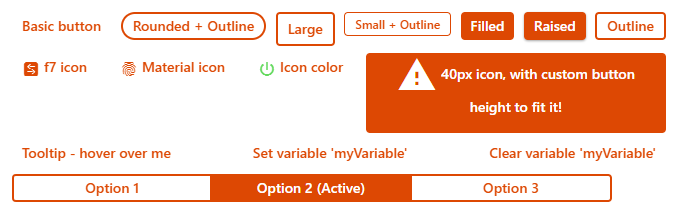
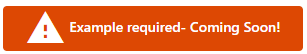

<style>
  .prop > ul {
    background-color: rgba(230,72,25,0.3); 
    border-radius: 5px 5px 0px 0px;
    list-style-type: none;
    padding: 5px;
    margin-bottom: 0px;
  }
  .prop > ul > li > a > code {
    background-color: rgba(255,255,255, 1)
  }
  .options {
    background-color: #eaecef;
    border-radius: 0px 0px 5px 5px;
    display: flex;
    flex-wrap: wrap;
    padding-left: 5px;
    margin-bottom: 15px;
  }
  .options > ul {
    list-style-type: none;
    padding-left: 5px;
    margin: 0px;
    columns: 1;
    column-gap: 0px;
  }
  .options > p {
    width: 100%;
    box-sizing: border-box;
    margin: 5px;
  }
  .options > p > br {
    content: '';
  }
  .options > p > br::after{
    content: ' ';
  }
  /* 410, 620, 900, 1200 */
  @media (min-width: 620px) {
  .options ul {
    columns: 1;
    column-gap: 0px;
    }
  }
  @media (min-width: 900px) {
  .options ul {
    columns: 2;
    column-gap: 60px;
    }
  }
  @media (min-width: 1200px) {
  .options ul {
    columns: 3;
    column-gap: 80px;
    }
  }
</style>


# oh-button - Button

<!-- GENERATED componentDescription -->
Button performing an action
<!-- GENERATED /componentDescription -->

<a href="#header"></a>

[[toc]]

## Usage / reference documents

* The `oh-button` component is based upon the [Framework 7 v5 Vue button control (`f7-button`)](https://v5.framework7.io/vue/button.html).
* Component styles are applied by the [Framework 7 CSS variables](https://v5.framework7.io/docs/button.html#css-variables).  For guidance on how to customise styles see the [CSS Styles](https://openhab.org/docs/ui/building-pages.html#css-variables) section.  
* Use the [`f7-segmented`](#f7-segmented) wrapper component to group buttons together.  Buttons with the property  `active: true` set will be highlighted/marked as selected.

## Configuration

<!-- GENERATED props -->

### General properties / Style

::: prop-head
- [`text`](#text) **Text** | Data type: TEXT
:::
::: prop-opt
Button label
:::

::: prop-head
- [`round`](#round) **Round** | Data type: BOOLEAN
:::
::: prop-opt
Makes button round
:::

::: prop-head
- [`large`](#large) **Large** | Data type: BOOLEAN
:::
::: prop-opt
Makes button large
:::

::: prop-head
- [`small`](#small) **Small** | Data type: BOOLEAN
:::
::: prop-opt
Makes button small
:::

::: prop-head
- [`fill`](#fill) **Fill** | Data type: BOOLEAN
:::
::: prop-opt
Makes button filled with color
:::

::: prop-head
- [`raised`](#raised) **Raised** | Data type: BOOLEAN
:::
::: prop-opt
Makes button raised
:::

::: prop-head
- [`outline`](#outline) **Outline** | Data type: BOOLEAN
:::
::: prop-opt
Makes button outline
:::

::: prop-head
- [`active`](#active) **Active** | Data type: TEXT
:::
::: prop-opt
Button is active (when part of a f7-segmented
:::

::: prop-head
- [`iconF7`](#iconF7) **Icon** | Data type: TEXT
:::
::: prop-opt
Framework7 icon to display (<a class="external text-color-blue" target="_blank" href="https://framework7.io/icons/">Framework7 icon</a>)
:::

::: prop-head
- [`iconMaterial`](#iconMaterial) **Icon** | Data type: TEXT
:::
::: prop-opt
Material design icon to display
:::

::: prop-head
- [`iconColor`](#iconColor) **Icon Color** | Data type: TEXT
:::
::: prop-opt
Not applicable to openHAB icons
:::

::: prop-head
- [`iconSize`](#iconSize) **Icon Size** | Data type: INTEGER
:::
::: prop-opt
Size of the icon in px
:::

::: prop-head
- [`tooltip`](#tooltip) **Tooltip** | Data type: TEXT
:::
::: prop-opt
Button tooltip text to show on button hover/press
:::

::: prop-head
- [`variable`](#variable) **Variable** | Data type: TEXT
:::
::: prop-opt
Name of the variable to set on input change
:::

::: prop-head
- [`clearVariable`](#clearVariable) **Clear Variable After Action** | Data type: BOOLEAN
:::
::: prop-opt
Name of the variable to clear after performing the action
:::

### Action

Action to perform when the element is clicked


::: prop-head
- [`action`](#action) **Action** | Data type: TEXT
:::
::: prop-opt
Type of action to perform
- [`navigate`](#action-navigate) Navigate to page
- [`command`](#action-command) Send command
- [`toggle`](#action-toggle) Toggle item
- [`options`](#action-options) Command options
- [`rule`](#action-rule) Run rule
- [`popup`](#action-popup) Open popup
- [`popover`](#action-popover) Open popover
- [`sheet`](#action-sheet) Open sheet
- [`photos`](#action-photos) Open photo browser
- [`group`](#action-group) Group details
- [`analyzer`](#action-analyzer) Analyze item(s)
- [`url`](#action-url) External URL
- [`variable`](#action-variable) Set Variable
:::

::: prop-head
- [`actionUrl`](#actionUrl) **Action URL** | Data type: TEXT
:::
::: prop-opt
URL to navigate to
:::

::: prop-head
- [`actionUrlSameWindow`](#actionUrlSameWindow) **Open in same tab/window** | Data type: BOOLEAN
:::
::: prop-opt
Open the URL in the same tab/window instead of a new one. This will exit the app.
:::

::: prop-head
- [`actionItem`](#actionItem) **Action Item** | Data type: TEXT
:::
::: prop-opt
Item to perform the action on
:::

::: prop-head
- [`actionCommand`](#actionCommand) **Action Command** | Data type: TEXT
:::
::: prop-opt
Command to send to the item. If "toggle item" is selected as the action, only send the command when the state is different
:::

::: prop-head
- [`actionCommandAlt`](#actionCommandAlt) **Action Toggle Command** | Data type: TEXT
:::
::: prop-opt
Command to send to the item when "toggle item" is selected as the action, and the item's state is equal to the command above
:::

::: prop-head
- [`actionOptions`](#actionOptions) **Command Options** | Data type: TEXT
:::
::: prop-opt
Comma-separated list of options; if omitted, retrieve the command options from the item dynamically. Use <code>value=label</code> format to provide a label different than the option.
:::

::: prop-head
- [`actionRule`](#actionRule) **Rule** | Data type: TEXT
:::
::: prop-opt
Rule to run
:::

::: prop-head
- [`actionPage`](#actionPage) **Page** | Data type: TEXT
:::
::: prop-opt
Page to navigate to
:::

::: prop-head
- [`actionPageTransition`](#actionPageTransition) **Transition Effect** | Data type: TEXT
:::
::: prop-opt
Use a specific <a class="external text-color-blue" target="_blank" href="https://framework7.io/docs/view.html#custom-page-transitions">page transition animation</a>
- [`f7-circle`](#actionPageTransition-f7-circle) Circle
- [`f7-cover`](#actionPageTransition-f7-cover) Cover
- [`f7-cover-v`](#actionPageTransition-f7-cover-v) Cover from bottom
- [`f7-dive`](#actionPageTransition-f7-dive) Dive
- [`f7-fade`](#actionPageTransition-f7-fade) Fade
- [`f7-flip`](#actionPageTransition-f7-flip) Flip
- [`f7-parallax`](#actionPageTransition-f7-parallax) Parallax
- [`f7-push`](#actionPageTransition-f7-push) Push
:::

::: prop-head
- [`actionModal`](#actionModal) **Modal Page or Widget** | Data type: TEXT
:::
::: prop-opt
Page or widget to display in the modal
:::

::: prop-head
- [`actionModalConfig`](#actionModalConfig) **Modal component configuration** | Data type: TEXT
:::
::: prop-opt
Configuration (prop values) for the target modal page or widget
:::

::: prop-head
- [`actionPhotos`](#actionPhotos) **Images to show** | Data type: TEXT
:::
::: prop-opt
Array of URLs or objects representing the images. Auto-refresh is not supported.<br />Edit in YAML or provide a JSON array, e.g.<br /><code>[ "url1", { "item": "ImageItem1", "caption": "Camera" } ]</code><br />Objects are in the <a class="external text-color-blue" target="_blank" href="https://framework7.io/docs/photo-browser.html#photos-array">photos array format</a> with an additional <code>item</code> property to specify an item to view.
:::

::: prop-head
- [`actionPhotoBrowserConfig`](#actionPhotoBrowserConfig) **Photo browser configuration** | Data type: TEXT
:::
::: prop-opt
Configuration for the photo browser.<br />Edit in YAML or provide a JSON object, e.g.<br /><code>{ "exposition": false, "type": "popup", "theme": "dark" }</code><br /> See <a class="external text-color-blue" target="_blank" href="https://framework7.io/docs/photo-browser.html#photo-browser-parameters">photo browser parameters</a> (not all are supported).
:::

::: prop-head
- [`actionGroupPopupItem`](#actionGroupPopupItem) **Group Popup Item** | Data type: TEXT
:::
::: prop-opt
Group item whose members to show in a popup
:::

::: prop-head
- [`actionAnalyzerItems`](#actionAnalyzerItems) **Item(s) to Analyze** | Data type: TEXT (multiple options are allowed)
:::
::: prop-opt
Start analyzing with the specified (set of) item(s)
:::

::: prop-head
- [`actionAnalyzerChartType`](#actionAnalyzerChartType) **Chart Type** | Data type: TEXT
:::
::: prop-opt
The initial analyzing period - dynamic or a predefined fixed period: day, week, month or year
- [`(empty)`](#actionAnalyzerChartType-empty) Dynamic
- [`day`](#actionAnalyzerChartType-day) Day
- [`isoWeek`](#actionAnalyzerChartType-isoWeek) Week (starting on Mondays)
- [`month`](#actionAnalyzerChartType-month) Month
- [`year`](#actionAnalyzerChartType-year) Year
:::

::: prop-head
- [`actionAnalyzerCoordSystem`](#actionAnalyzerCoordSystem) **Initial Coordinate System** | Data type: TEXT
:::
::: prop-opt
The initial coordinate system of the analyzer - time, aggregate or calendar (only time is supported for dynamic periods)
- [`time`](#actionAnalyzerCoordSystem-time) Time
- [`aggregate`](#actionAnalyzerCoordSystem-aggregate) Aggregate
- [`calendar`](#actionAnalyzerCoordSystem-calendar) Calendar
:::

::: prop-head
- [`actionFeedback`](#actionFeedback) **Action feedback** | Data type: TEXT
:::
::: prop-opt
Shows a toast popup when the action has been executed. Can either be a text to show or a JSON object including some of the <a class="external text-color-blue" target="_blank" href="https://framework7.io/docs/toast.html#toast-parameters">supported parameters</a>
:::

::: prop-head
- [`actionVariable`](#actionVariable) **Variable** | Data type: TEXT
:::
::: prop-opt
The variable name to set
:::

::: prop-head
- [`actionVariableValue`](#actionVariableValue) **Variable Value** | Data type: TEXT
:::
::: prop-opt
The value to set the variable to
:::

<!-- GENERATED /props -->

### Inherited Properties
The configuration is passed to the underlying `f7-button` component from Framework7 v5.  All compatible scalar [properties](https://v5.framework7.io/vue/button.html#button-properties) (except functions) not listed above are available for use.

### Slots
There are no slots supported by this control.

## Examples
### Header Image Source Code

<!-- BOOKMARKS to this example -->
<div id="text"></div>
<div id="round"></div>
<div id="large"></div>
<div id="small"></div>
<div id="filled"></div>
<div id="raised"></div>
<div id="outline"></div>
<div id="active"></div>
<div id="iconf7"></div>
<div id="iconMaterial"></div>
<div id="iconColor"></div>
<div id="iconSize"></div>
<div id="tooltip"></div>
<div id="variable"></div>
<div id="clearVariable"></div>
<div id="f7-segemented"></div>

This example code generates the example button image used at the top of this page:
::: details Click to view the YAML source code:
```yaml
uid: oh-button
tags: []
timestamp: Feb 9, 2021, 5:42:56 PM
component: f7-card
config:
  title: oh-button
slots:
  default:
    - component: f7-block
      config:
        class: bog
        style:
          display: flex
          flex-wrap: wrap
          justify-content: space-between
          align-content: space-between
          height: 230px
          padding-bottom: 20px
      slots:
        default:
          - component: oh-button
            config:
              width: 400px
              text: Basic button
          - component: oh-button
            config:
              width: 400px
              text: Rounded + Outline
              round: true
              outline: true
          - component: oh-button
            config:
              text: Large
              outline: true
              large: true
              grid-colum: 3
              grid-row: 1
          - component: oh-button
            config:
              text: Small + Outline
              outline: true
              small: true
          - component: oh-button
            config:
              text: Filled
              fill: true
          - component: oh-button
            config:
              text: Raised
              fill: true
              raised: true
          - component: oh-button
            config:
              text: Outline
              outline: true
          - component: oh-button
            config:
              text: f7 icon
              iconF7: arrow_right_arrow_left_square_fill
              tooltip: Click to view f7 icons
              action: url
              actionUrl: https://framework7.io/icons/
          - component: oh-button
            config:
              text: Material icon
              iconMaterial: fingerprint
              tooltip: Click to view Material icons
              action: url
              actionUrl: https://material.io/resources/icons/
          - component: oh-button
            config:
              text: Icon color
              iconMaterial: power_settings_new
              iconColor: green
          - component: oh-button
            config:
              text: 40px icon, with custom button height to fit it!
              outline: true
              fill: true
              iconMaterial: report_problem
              iconSize: 40
              style:
                height: 80px
                width: 300px
                white-space: normal
          - component: oh-button
            config:
              text: Tooltip - hover over me
              tooltip: Don't Panic
          - component: oh-button
            config:
              text: Set variable 'myVariable'
              variable: myVariable
              action: variable
              actionVariable: myVariable
              actionVariableValue: 1
          - component: oh-button
            config:
              text: Clear variable 'myVariable'
              clearVariable: myVariable
              action: variable
              actionVariable: myVariable
          - component: f7-segmented
            slots:
              default:
                - component: oh-button
                  config:
                    text: Option 1
                    outline: true
                    style:
                      width: 200px
                - component: oh-button
                  config:
                    text: Option 2 (Active)
                    outline: true
                    active: true
                    style:
                      width: 200px
                - component: oh-button
                  config:
                    text: Option 3
                    outline: true
                    style:
                      width: 200px
```
:::

### action: variable
<!-- BOOKMARKS to this example -->
<div id="action-variable"></div>


Example required:

::: details Click to view the source code:
```yaml
<<< @/code/oh-button/header.yml{21-125} 
```
:::

### Community posts
The following posts contain great examples of the use of this control:
* [BoGoB: Big Ol' Grid O' Buttons](https://community.openhab.org/t/bogob-big-ol-grid-o-buttons-is-this-even-possible-yes-yes-it-is/115343/7?u=andymb) - using the `oh-button` and `oh-repeater` objects together with YAML arrays to create large grids of buttons (emulating remote control operation).
* [OH3 Widget : Four Button List Item Widget](https://community.openhab.org/t/oh3-widget-four-button-list-item-widget/117012?u=andymb) - a four button list item widget to set the sound volume to pne of four preset levels.

<EditPageLink/>