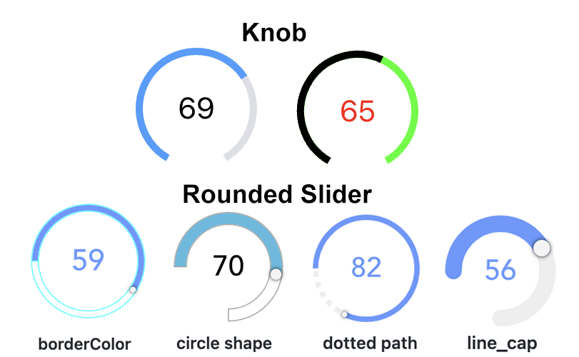

# oh-knob-card - Knob & Rounded Slider Card



[[toc]]

<!-- Note: you can overwrite the definition-provided description and add your own intro/additional sections instead -->
<!-- DO NOT REMOVE the following comments if you intend to keep the definition-provided description -->
<!-- GENERATED componentDescription -->
Display a knob or a rounded slider in a card to visualize and control a quantifiable item
<!-- GENERATED /componentDescription -->

## Configuration

Use the advanced properties to change the appearance from a knob to a rounded slider.

<!-- DO NOT REMOVE the following comments -->
<!-- GENERATED props -->
### Card
<div class="props">
<PropGroup name="card" label="Card">
  Parameters of the card
<PropBlock type="TEXT" name="title" label="Title">
  <PropDescription>
    Title of the card
  </PropDescription>
</PropBlock>
<PropBlock type="TEXT" name="footer" label="Footer text">
  <PropDescription>
    Footer of the card
  </PropDescription>
</PropBlock>
<PropBlock type="BOOLEAN" name="noBorder" label="No Border">
  <PropDescription>
    Do not render the card border
  </PropDescription>
</PropBlock>
<PropBlock type="BOOLEAN" name="noShadow" label="No Shadow">
  <PropDescription>
    Do not render a shadow effect to the card
  </PropDescription>
</PropBlock>
<PropBlock type="BOOLEAN" name="outline" label="Outline">
  <PropDescription>
    Show the card outline
  </PropDescription>
</PropBlock>
</PropGroup>
</div>

### Knob & Rounded Slider
<div class="props">
<PropGroup name="knob" label="Knob & Rounded Slider">
  Parameters are passed to the underlying <a target="_blank" class="external text-color-blue" href="https://github.com/soundar24/vue-round-slider#props">round-slider control</a>
<PropBlock type="TEXT" name="item" label="Item" context="item">
  <PropDescription>
    Item to control
  </PropDescription>
</PropBlock>
<PropBlock type="INTEGER" name="min" label="Min">
  <PropDescription>
    Minimum value (default 0)
  </PropDescription>
</PropBlock>
<PropBlock type="INTEGER" name="max" label="Max">
  <PropDescription>
    Maximum value (default 100)
  </PropDescription>
</PropBlock>
<PropBlock type="TEXT" name="circleShape" label="Circle Shape">
  <PropDescription>
    full, pie, half-top/-bottom/-left/-right, quarter-top-left/-right, quarter-bottom-left/-right
  </PropDescription>
</PropBlock>
<PropBlock type="INTEGER" name="startAngle" label="Start Angle">
  <PropDescription>
    Angle of circle where the round slider should start (default -50); 0 is 9 o'clock; only if circleShape is not set
  </PropDescription>
</PropBlock>
<PropBlock type="INTEGER" name="endAngle" label="End Angle">
  <PropDescription>
    Angle of circle where the round slider should start (default -130); 360 is 9 o'clock; only if circleShape is not set
  </PropDescription>
</PropBlock>
<PropBlock type="DECIMAL" name="stepSize" label="Step">
  <PropDescription>
    Minimum interval between values (default 1)
  </PropDescription>
</PropBlock>
<PropBlock type="BOOLEAN" name="disabled" label="Disabled">
  <PropDescription>
    Disable the slider (usually set via an expression since the value will not be displayed when disabled)
  </PropDescription>
</PropBlock>
<PropBlock type="INTEGER" name="size" label="Size">
  <PropDescription>
    Visual size of the control in px (or % if responsive is true)
  </PropDescription>
</PropBlock>
<PropBlock type="TEXT" name="primaryColor" label="Primary Color">
  <PropDescription>
    Color of the value arc (HTML value)
  </PropDescription>
</PropBlock>
<PropBlock type="TEXT" name="secondaryColor" label="Secondary Color">
  <PropDescription>
    Color of the rest of the control (HTML value)
  </PropDescription>
</PropBlock>
<PropBlock type="TEXT" name="textColor" label="Text Color">
  <PropDescription>
    Color of the value text (HTML value, default inherits from primaryColor)
  </PropDescription>
</PropBlock>
<PropBlock type="TEXT" name="borderColor" label="Border Color">
  <PropDescription>
    Sets the border color of the slider; set borderWidth as well! (HTML value)
  </PropDescription>
</PropBlock>
<PropBlock type="INTEGER" name="borderWidth" label="Border Width">
  <PropDescription>
    Sets the border width of the slider (px value)
  </PropDescription>
</PropBlock>
<PropBlock type="INTEGER" name="strokeWidth" label="Stroke Width">
  <PropDescription>
    Thickness of the arcs (default 18)
  </PropDescription>
</PropBlock>
<PropBlock type="TEXT" name="lineCap" label="Line End Type">
  <PropDescription>
    butt, round, square, none
  </PropDescription>
</PropBlock>
<PropBlock type="TEXT" name="dottedPath" label="Dotted Path">
  <PropDescription>
    Length of dotted path segments (css stroke-dasharray)
  </PropDescription>
</PropBlock>
<PropBlock type="BOOLEAN" name="responsive" label="Responsive">
  <PropDescription>
    Size the control using percentages instead of pixels
  </PropDescription>
</PropBlock>
<PropBlock type="BOOLEAN" name="releaseOnly" label="Send command only on release">
  <PropDescription>
    If enabled, no commands are sent during sliding
  </PropDescription>
</PropBlock>
<PropBlock type="INTEGER" name="commandInterval" label="Command Interval">
  <PropDescription>
    Time to wait between subsequent commands in ms (default 200)
  </PropDescription>
</PropBlock>
<PropBlock type="INTEGER" name="delayStateDisplay" label="Delay State Display">
  <PropDescription>
    Time to wait before switching from displaying user input to displaying Item state in ms (default 2000)
  </PropDescription>
</PropBlock>
</PropGroup>
</div>


<!-- GENERATED /props -->

### Inherited Properties

Properties are forwarded to the underlying [vue-round-slider](https://vue.roundsliderui.com/) component, which means you can set [these parameters](https://roundsliderui.com/document.html#options.
A compatibility layer ensures backward compatibility with the [vue-knob-control](https://github.com/kramer99/vue-knob-control#readme) component that was initially used.

<!-- If applicable describe the slots recognized by the component and what they represent:
### Slots

#### `default`

The contents of the oh-knob-card.

-->

<!-- Add as many examples as desired - put the YAML in a details container when it becomes too long (~150/200+ lines):
## Examples

### Example 1


```yaml
component: oh-knob-card
config:
  prop1: value1
  prop2: value2
```

### Example 2


::: details YAML
```yaml
component: oh-knob-card
config:
  prop1: value1
  prop2: value2
slots
```
:::

-->

<!-- Try to clean up URLs to the forum (https://community.openhab.org/t/<threadID>[/<postID>] should suffice)
## Community Resources

- [Community Post 1](https://community.openhab.org/t/12345)
- [Community Post 2](https://community.openhab.org/t/23456)
-->
